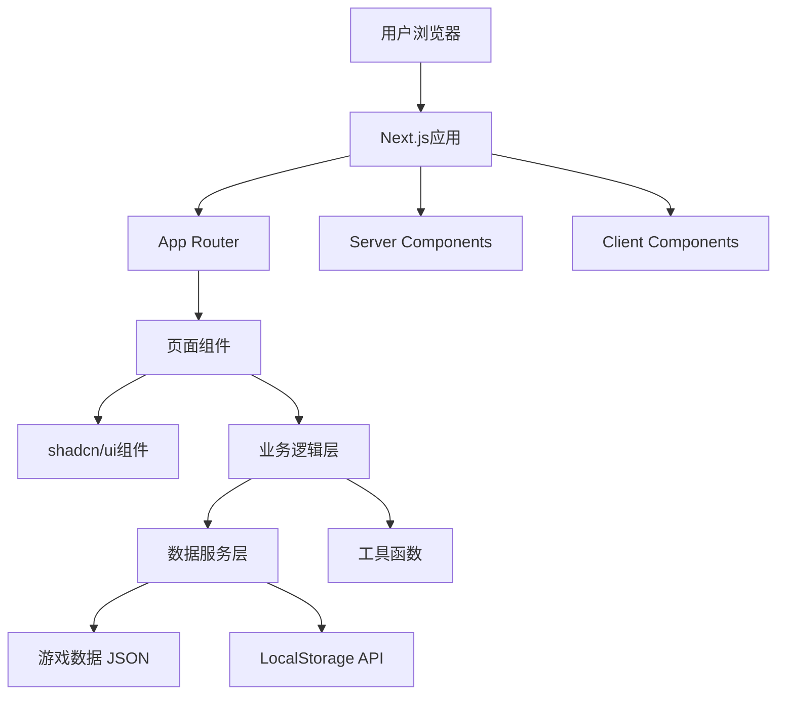

# 设计文档

## 概述

破冰游戏网站是一个单页应用（SPA），采用现代前端技术栈构建。网站将提供流畅的用户体验，支持游戏浏览、搜索、详情查看和收藏等功能。考虑到项目的性质和规模，我们将采用静态网站架构，所有游戏数据通过JSON文件管理，使用本地存储保存用户偏好。

## 架构

### 技术栈

- **框架**: Next.js 14+ (App Router) with TypeScript
- **UI组件库**: shadcn/ui（基于Radix UI）
- **样式方案**: Tailwind CSS
- **状态管理**: React Context API + Hooks（轻量级状态管理）
- **数据存储**: 
  - 游戏数据：静态JSON文件
  - 用户数据：LocalStorage
- **部署**: Vercel（Next.js原生支持）

### 系统架构图



### 目录结构

```
app/
├── (routes)/           # 路由组
│   ├── page.tsx       # 首页
│   ├── game/
│   │   └── [id]/
│   │       └── page.tsx  # 游戏详情页
│   ├── favorites/
│   │   └── page.tsx   # 收藏页
│   └── search/
│       └── page.tsx   # 搜索结果页
├── layout.tsx         # 根布局
└── globals.css        # 全局样式

components/
├── ui/                # shadcn/ui组件
│   ├── button.tsx
│   ├── card.tsx
│   ├── input.tsx
│   ├── badge.tsx
│   └── ...
├── game/              # 游戏相关组件
│   ├── game-card.tsx
│   ├── game-grid.tsx
│   ├── game-detail.tsx
│   └── favorite-button.tsx
├── layout/            # 布局组件
│   ├── header.tsx
│   ├── footer.tsx
│   └── nav.tsx
└── search/            # 搜索相关组件
    ├── search-bar.tsx
    └── filter-bar.tsx

lib/
├── services/          # 数据服务
│   ├── game-service.ts
│   └── storage-service.ts
├── hooks/             # 自定义Hooks
│   ├── use-games.ts
│   ├── use-favorites.ts
│   └── use-search.ts
├── utils/             # 工具函数
│   ├── filter.ts
│   ├── search.ts
│   └── cn.ts         # shadcn工具函数
└── types/             # TypeScript类型定义
    └── game.ts

data/
└── games.json         # 游戏数据

public/
└── images/            # 静态图片资源
```

## 组件和接口

### 核心组件

#### 1. 布局组件

**Header** (`components/layout/header.tsx`)
- 类型：Client Component（包含搜索交互）
- 功能：导航栏、搜索框、Logo
- 使用shadcn/ui: Input组件

**Footer** (`components/layout/footer.tsx`)
- 类型：Server Component
- 功能：版权信息、链接

**RootLayout** (`app/layout.tsx`)
- 类型：Server Component
- 功能：页面整体布局容器，包含Header和Footer
- Props: `children: ReactNode`

#### 2. 游戏展示组件

**GameCard** (`components/game/game-card.tsx`)
- 类型：Server Component
- 功能：游戏卡片展示，使用shadcn/ui Card组件
- Props:
  ```typescript
  interface GameCardProps {
    game: Game;
    isFavorite?: boolean;
  }
  ```

**GameGrid** (`components/game/game-grid.tsx`)
- 类型：Server Component
- 功能：游戏卡片网格布局
- Props:
  ```typescript
  interface GameGridProps {
    games: Game[];
  }
  ```

**GameDetail** (`components/game/game-detail.tsx`)
- 类型：Server Component
- 功能：游戏详细信息展示
- Props:
  ```typescript
  interface GameDetailProps {
    game: Game;
  }
  ```

#### 3. 筛选和搜索组件

**FilterBar** (`components/search/filter-bar.tsx`)
- 类型：Client Component
- 功能：游戏筛选控制
- 使用shadcn/ui: Select, Slider组件
- Props:
  ```typescript
  interface FilterBarProps {
    onFilterChange: (filters: GameFilters) => void;
    categories: string[];
  }
  ```

**SearchBar** (`components/search/search-bar.tsx`)
- 类型：Client Component
- 功能：搜索输入框
- 使用shadcn/ui: Input组件
- Props:
  ```typescript
  interface SearchBarProps {
    onSearch: (query: string) => void;
    placeholder?: string;
  }
  ```

#### 4. 功能组件

**RandomGameButton** (`components/game/random-game-button.tsx`)
- 类型：Client Component
- 功能：随机推荐游戏
- 使用shadcn/ui: Button组件
- Props:
  ```typescript
  interface RandomGameButtonProps {
    games: Game[];
  }
  ```

**FavoriteButton** (`components/game/favorite-button.tsx`)
- 类型：Client Component（需要LocalStorage交互）
- 功能：收藏/取消收藏按钮
- 使用shadcn/ui: Button组件，使用Heart图标
- Props:
  ```typescript
  interface FavoriteButtonProps {
    gameId: string;
  }
  ```

### 页面组件（Next.js App Router）

#### HomePage (`app/page.tsx`)
- 路由：`/`
- 类型：Server Component（默认）
- 功能：展示游戏分类、推荐游戏、筛选功能
- 数据：服务端加载游戏列表

#### GameDetailPage (`app/game/[id]/page.tsx`)
- 路由：`/game/[id]`
- 类型：Server Component
- 功能：显示游戏完整信息
- 数据：服务端根据ID加载游戏详情
- 客户端交互：收藏按钮（Client Component）

#### FavoritesPage (`app/favorites/page.tsx`)
- 路由：`/favorites`
- 类型：Client Component（需要访问LocalStorage）
- 功能：显示用户收藏的游戏
- 状态：从LocalStorage读取收藏列表

#### SearchResultsPage (`app/search/page.tsx`)
- 路由：`/search`
- 类型：Client Component（交互式搜索）
- 功能：显示搜索结果
- 状态：搜索关键词、结果列表

## 数据模型

### Game 类型定义

```typescript
interface Game {
  id: string;
  title: string;
  description: string;
  shortDescription: string;
  category: GameCategory;
  participants: {
    min: number;
    max: number;
  };
  duration: {
    min: number; // 分钟
    max: number;
  };
  difficulty: 'easy' | 'medium' | 'hard';
  materials: string[];
  steps: string[];
  tips: string[];
  variants?: string[];
  tags: string[];
  objectives: string[];
}

type GameCategory = 
  | 'team-building'
  | 'online-meeting'
  | 'small-group'
  | 'creative-thinking'
  | 'energizer'
  | 'get-to-know';

interface GameFilters {
  category?: GameCategory;
  minParticipants?: number;
  maxParticipants?: number;
  maxDuration?: number;
  difficulty?: string;
}
```

### 用户数据模型

```typescript
interface UserPreferences {
  favorites: string[]; // 游戏ID数组
  recentlyViewed: string[];
}
```

## 服务层设计

### GameService

```typescript
class GameService {
  // 获取所有游戏
  getAllGames(): Promise<Game[]>
  
  // 根据ID获取游戏
  getGameById(id: string): Promise<Game | null>
  
  // 根据分类获取游戏
  getGamesByCategory(category: GameCategory): Promise<Game[]>
  
  // 搜索游戏
  searchGames(query: string): Promise<Game[]>
  
  // 筛选游戏
  filterGames(filters: GameFilters): Promise<Game[]>
  
  // 获取随机游戏
  getRandomGame(filters?: GameFilters): Promise<Game>
  
  // 获取所有分类
  getCategories(): string[]
}
```

### StorageService

```typescript
class StorageService {
  // 添加收藏
  addFavorite(gameId: string): void
  
  // 移除收藏
  removeFavorite(gameId: string): void
  
  // 获取所有收藏
  getFavorites(): string[]
  
  // 检查是否已收藏
  isFavorite(gameId: string): boolean
  
  // 添加最近查看
  addRecentlyViewed(gameId: string): void
  
  // 获取最近查看
  getRecentlyViewed(): string[]
}
```

## 用户界面设计

### 设计原则

1. **简洁明了**：使用清晰的视觉层次，避免信息过载
2. **响应式优先**：移动端优先设计，确保各设备体验一致
3. **快速访问**：重要功能（搜索、分类、随机推荐）始终可见
4. **视觉反馈**：所有交互提供即时反馈

### 色彩方案

- **主色调**：活力橙色/蓝色（体现破冰游戏的活跃氛围）
- **辅助色**：中性灰色系
- **强调色**：用于CTA按钮和重要信息
- **背景色**：浅色系，确保内容可读性

### 响应式断点

```css
/* Mobile First */
- Mobile: < 640px
- Tablet: 640px - 1024px
- Desktop: > 1024px
```

### 详细界面布局设计

#### 1. 首页布局（桌面端）- 参考 Sprunkin 风格

```
┌─────────────────────────────────────────────────────────────────────────┐
│  Header（固定顶部，半透明背景）                                          │
│  ┌────────────┐                                    ┌──────────────────┐ │
│  │ 🎮 破冰游戏 │         [首页] [分类] [收藏]       │  🔍 搜索...      │ │
│  └────────────┘                                    └──────────────────┘ │
└─────────────────────────────────────────────────────────────────────────┘

┌─────────────────────────────────────────────────────────────────────────┐
│  Hero Banner（全宽，渐变背景，视觉冲击力强）                             │
│  ┌───────────────────────────────────────────────────────────────────┐  │
│  │                                                                    │  │
│  │              🎯 破冰游戏大全 - Ice Breaker Games                  │  │
│  │                                                                    │  │
│  │         发现最适合你的团队建设和社交活动游戏                       │  │
│  │         让每次聚会都充满欢声笑语                                   │  │
│  │                                                                    │  │
│  │         ┌──────────────────┐    ┌──────────────────┐             │  │
│  │         │  🎲 随机推荐游戏  │    │  📚 浏览所有游戏  │             │  │
│  │         └──────────────────┘    └──────────────────┘             │  │
│  │                                                                    │  │
│  │         [统计数据]  50+ 游戏  |  10+ 分类  |  适合 3-100 人       │  │
│  │                                                                    │  │
│  └───────────────────────────────────────────────────────────────────┘  │
└─────────────────────────────────────────────────────────────────────────┘

┌─────────────────────────────────────────────────────────────────────────┐
│  热门分类（大图标卡片，类似游戏选择界面）                                │
│  ┌─────────────────────────────────────────────────────────────────┐   │
│  │  🔥 热门分类                                                     │   │
│  │                                                                  │   │
│  │  ┌──────────────┐  ┌──────────────┐  ┌──────────────┐         │   │
│  │  │   👥         │  │   💻         │  │   🎨         │         │   │
│  │  │              │  │              │  │              │         │   │
│  │  │  团队建设    │  │  线上会议    │  │  创意思维    │         │   │
│  │  │  (15个游戏)  │  │  (12个游戏)  │  │  (10个游戏)  │         │   │
│  │  │              │  │              │  │              │         │   │
│  │  └──────────────┘  └──────────────┘  └──────────────┘         │   │
│  │                                                                  │   │
│  │  ┌──────────────┐  ┌──────────────┐  ┌──────────────┐         │   │
│  │  │   ⚡         │  │   🤝         │  │   👋         │         │   │
│  │  │              │  │              │  │              │         │   │
│  │  │  快速破冰    │  │  小组活动    │  │  初次见面    │         │   │
│  │  │  (8个游戏)   │  │  (13个游戏)  │  │  (9个游戏)   │         │   │
│  │  │              │  │              │  │              │         │   │
│  │  └──────────────┘  └──────────────┘  └──────────────┘         │   │
│  └─────────────────────────────────────────────────────────────────┘   │
└─────────────────────────────────────────────────────────────────────────┘

┌─────────────────────────────────────────────────────────────────────────┐
│  快速筛选（Pill 按钮，可点击切换）                                       │
│  ┌─────────────────────────────────────────────────────────────────┐   │
│  │  🎯 快速查找：                                                   │   │
│  │                                                                  │   │
│  │  [全部] [5-10人] [10-20人] [20+人] [5分钟] [15分钟] [30分钟+]  │   │
│  │  [简单] [中等] [困难] [无需材料] [需要道具]                     │   │
│  │                                                                  │   │
│  │  已选择: 5-10人, 简单  ✕    显示 12 个游戏                      │   │
│  └─────────────────────────────────────────────────────────────────┘   │
└─────────────────────────────────────────────────────────────────────────┘

┌─────────────────────────────────────────────────────────────────────────┐
│  精选游戏（大卡片展示，类似游戏封面）                                    │
│  ┌─────────────────────────────────────────────────────────────────┐   │
│  │  ⭐ 最受欢迎                                    [查看全部 →]     │   │
│  │                                                                  │   │
│  │  ┌────────────────────┐  ┌────────────────────┐               │   │
│  │  │ [大图/插图]        │  │ [大图/插图]        │               │   │
│  │  │                    │  │                    │               │   │
│  │  │ 两真一假           │  │ 人类结             │               │   │
│  │  │ [团队建设]         │  │ [破冰游戏]         │               │   │
│  │  │                    │  │                    │               │   │
│  │  │ 👥 5-20人          │  │ 👥 10-30人         │               │   │
│  │  │ ⏱️ 15-20分钟       │  │ ⏱️ 10-15分钟       │               │   │
│  │  │ ⭐⭐⭐⭐⭐         │  │ ⭐⭐⭐⭐⭐         │               │   │
│  │  │                    │  │                    │               │   │
│  │  │ [♥ 收藏] [开始玩→] │  │ [♥ 收藏] [开始玩→] │               │   │
│  │  └────────────────────┘  └────────────────────┘               │   │
│  └─────────────────────────────────────────────────────────────────┘   │
└─────────────────────────────────────────────────────────────────────────┘

┌─────────────────────────────────────────────────────────────────────────┐
│  所有游戏（网格布局，4列）                                               │
│  ┌─────────────────────────────────────────────────────────────────┐   │
│  │  🎮 所有游戏                                                     │   │
│  │                                                                  │   │
│  │  ┌─────────┐ ┌─────────┐ ┌─────────┐ ┌─────────┐              │   │
│  │  │[图标]   │ │[图标]   │ │[图标]   │ │[图标]   │              │   │
│  │  │         │ │         │ │         │ │         │              │   │
│  │  │游戏名称 │ │游戏名称 │ │游戏名称 │ │游戏名称 │              │   │
│  │  │[标签]   │ │[标签]   │ │[标签]   │ │[标签]   │              │   │
│  │  │         │ │         │ │         │ │         │              │   │
│  │  │👥⏱️📊  │ │👥⏱️📊  │ │👥⏱️📊  │ │👥⏱️📊  │              │   │
│  │  │         │ │         │ │         │ │         │              │   │
│  │  │[♥][→]  │ │[♥][→]  │ │[♥][→]  │ │[♥][→]  │              │   │
│  │  └─────────┘ └─────────┘ └─────────┘ └─────────┘              │   │
│  │                                                                  │   │
│  │  ┌─────────┐ ┌─────────┐ ┌─────────┐ ┌─────────┐              │   │
│  │  │[卡片]   │ │[卡片]   │ │[卡片]   │ │[卡片]   │              │   │
│  │  └─────────┘ └─────────┘ └─────────┘ └─────────┘              │   │
│  │                                                                  │   │
│  │  ┌─────────┐ ┌─────────┐ ┌─────────┐ ┌─────────┐              │   │
│  │  │[卡片]   │ │[卡片]   │ │[卡片]   │ │[卡片]   │              │   │
│  │  └─────────┘ └─────────┘ └─────────┘ └─────────┘              │   │
│  │                                                                  │   │
│  │                    [加载更多游戏]                                │   │
│  └─────────────────────────────────────────────────────────────────┘   │
└─────────────────────────────────────────────────────────────────────────┘

┌─────────────────────────────────────────────────────────────────────────┐
│  使用场景推荐（横向滚动卡片）                                             │
│  ┌─────────────────────────────────────────────────────────────────┐   │
│  │  💡 按场景选择                                                   │   │
│  │                                                                  │   │
│  │  ← ┌──────────────┐ ┌──────────────┐ ┌──────────────┐ →       │   │
│  │    │ 🏢 新员工    │ │ 🎉 年会      │ │ 💻 远程团队  │         │   │
│  │    │   入职培训   │ │   团建活动   │ │   线上会议   │         │   │
│  │    │              │ │              │ │              │         │   │
│  │    │ 推荐5个游戏  │ │ 推荐8个游戏  │ │ 推荐6个游戏  │         │   │
│  │    │ [查看 →]     │ │ [查看 →]     │ │ [查看 →]     │         │   │
│  │    └──────────────┘ └──────────────┘ └──────────────┘         │   │
│  └─────────────────────────────────────────────────────────────────┘   │
└─────────────────────────────────────────────────────────────────────────┘

┌─────────────────────────────────────────────────────────────────────────┐
│  Footer（深色背景）                                                      │
│  ┌─────────────────────────────────────────────────────────────────┐   │
│  │  🎮 破冰游戏大全                                                 │   │
│  │  让每次聚会都充满欢声笑语                                        │   │
│  │                                                                  │   │
│  │  [关于我们]  [联系方式]  [隐私政策]  [使用条款]                 │   │
│  │                                                                  │   │
│  │  © 2024 破冰游戏大全. All rights reserved.                      │   │
│  │                                                                  │   │
│  │  [社交媒体图标]  📧 💬 🐦                                        │   │
│  └─────────────────────────────────────────────────────────────────┘   │
└─────────────────────────────────────────────────────────────────────────┘
```

### 设计特点（参考 Sprunkin 风格）

#### 1. 视觉层次清晰
- **Hero Banner**：大标题 + 渐变背景 + 明确的 CTA 按钮
- **分类卡片**：大图标 + 游戏数量，类似游戏选择界面
- **精选游戏**：大卡片展示，突出最受欢迎的内容
- **网格布局**：4列紧凑布局，展示更多内容

#### 2. 交互友好
- **快速筛选**：Pill 按钮样式，可点击切换，实时显示结果数量
- **分类导航**：大图标卡片，直观易懂
- **悬停效果**：卡片悬停时放大、阴影加深
- **加载更多**：无限滚动或"加载更多"按钮

#### 3. 游戏化设计
- **图标丰富**：使用 emoji 和图标增加趣味性
- **色彩鲜明**：每个分类使用不同颜色
- **卡片设计**：类似游戏封面的视觉效果
- **统计数据**：显示游戏数量、评分等

#### 4. 内容组织
- **分层展示**：
  1. Hero Banner（吸引注意）
  2. 热门分类（快速导航）
  3. 快速筛选（精准查找）
  4. 精选游戏（推荐内容）
  5. 所有游戏（完整列表）
  6. 场景推荐（使用指导）

#### 5. 响应式适配
- **桌面端**：4列网格，大卡片展示
- **平板端**：3列网格，中等卡片
- **移动端**：2列或单列，紧凑布局

#### 2. 游戏详情页布局（桌面端）

```
┌─────────────────────────────────────────────────────────────────┐
│  Header（同首页）                                                │
└─────────────────────────────────────────────────────────────────┘

┌─────────────────────────────────────────────────────────────────┐
│  面包屑导航                                                      │
│  首页 > 团队建设 > 两真一假                                      │
└─────────────────────────────────────────────────────────────────┘

┌─────────────────────────────────────────────────────────────────┐
│  游戏标题区域                                                    │
│  ┌───────────────────────────────────────────────────────────┐  │
│  │  ← 返回                                    [♥ 收藏] [🔗 分享] [🖨️ 打印] │
│  │                                                            │  │
│  │  两真一假                                                  │  │
│  │  [团队建设] [破冰游戏]                                     │  │
│  │                                                            │  │
│  │  ┌──────────┐ ┌──────────┐ ┌──────────┐ ┌──────────┐    │  │
│  │  │ 👥 5-20人 │ │ ⏱️ 15-20分│ │ 📊 简单   │ │ 📦 无需材料│    │  │
│  │  └──────────┘ └──────────┘ └──────────┘ └──────────┘    │  │
│  └───────────────────────────────────────────────────────────┘  │
└─────────────────────────────────────────────────────────────────┘

┌─────────────────────────────────────────────────────────────────┐
│  游戏内容（主要区域）                                            │
│                                                                  │
│  ┌─────────────────────────────────────────────────────────┐   │
│  │ 📝 游戏简介                                              │   │
│  │ 这是一个经典的破冰游戏，参与者分享关于自己的三个陈述... │   │
│  └─────────────────────────────────────────────────────────┘   │
│                                                                  │
│  ┌─────────────────────────────────────────────────────────┐   │
│  │ 🎯 游戏目标                                              │   │
│  │ • 帮助团队成员相互了解                                   │   │
│  │ • 营造轻松的氛围                                         │   │
│  │ • 锻炼观察和判断能力                                     │   │
│  └─────────────────────────────────────────────────────────┘   │
│                                                                  │
│  ┌─────────────────────────────────────────────────────────┐   │
│  │ 📦 所需材料                                              │   │
│  │ • 无需特殊材料                                           │   │
│  └─────────────────────────────────────────────────────────┘   │
│                                                                  │
│  ┌─────────────────────────────────────────────────────────┐   │
│  │ 🎮 游戏步骤                                              │   │
│  │                                                          │   │
│  │ 1️⃣ 准备阶段                                             │   │
│  │    让所有参与者围成一圈或坐在一起...                     │   │
│  │                                                          │   │
│  │ 2️⃣ 说明规则                                             │   │
│  │    每个人需要想出关于自己的三个陈述...                   │   │
│  │                                                          │   │
│  │ 3️⃣ 开始游戏                                             │   │
│  │    第一个人分享自己的三个陈述...                         │   │
│  │                                                          │   │
│  │ 4️⃣ 猜测环节                                             │   │
│  │    其他参与者讨论并投票...                               │   │
│  │                                                          │   │
│  │ 5️⃣ 揭晓答案                                             │   │
│  │    分享者公布正确答案...                                 │   │
│  └─────────────────────────────────────────────────────────┘   │
│                                                                  │
│  ┌─────────────────────────────────────────────────────────┐   │
│  │ 💡 游戏提示                                              │   │
│  │ • 鼓励参与者分享有趣的事实                               │   │
│  │ • 主持人要营造轻松的氛围                                 │   │
│  │ • 可以设置时间限制增加趣味性                             │   │
│  └─────────────────────────────────────────────────────────┘   │
│                                                                  │
│  ┌─────────────────────────────────────────────────────────┐   │
│  │ 🔄 游戏变体                                              │   │
│  │ • 线上版本：使用视频会议工具...                          │   │
│  │ • 快速版本：每人只说两个陈述...                          │   │
│  └─────────────────────────────────────────────────────────┘   │
└─────────────────────────────────────────────────────────────────┘

┌─────────────────────────────────────────────────────────────────┐
│  相关游戏推荐                                                    │
│  你可能也喜欢这些游戏                                            │
│                                                                  │
│  ┌──────────────┐  ┌──────────────┐  ┌──────────────┐         │
│  │ [游戏卡片]   │  │ [游戏卡片]   │  │ [游戏卡片]   │         │
│  └──────────────┘  └──────────────┘  └──────────────┘         │
└─────────────────────────────────────────────────────────────────┘

┌─────────────────────────────────────────────────────────────────┐
│  Footer（同首页）                                                │
└─────────────────────────────────────────────────────────────────┘
```

#### 3. 收藏页面布局

```
┌─────────────────────────────────────────────────────────────────┐
│  Header（同首页）                                                │
└─────────────────────────────────────────────────────────────────┘

┌─────────────────────────────────────────────────────────────────┐
│  我的收藏                                                        │
│  你已收藏 8 个游戏                                               │
│                                                                  │
│  [按分类] [按人数] [按时长]                                      │
└─────────────────────────────────────────────────────────────────┘

┌─────────────────────────────────────────────────────────────────┐
│  收藏的游戏网格（同首页游戏网格）                                │
│                                                                  │
│  ┌──────────────┐  ┌──────────────┐  ┌──────────────┐         │
│  │ [游戏卡片]   │  │ [游戏卡片]   │  │ [游戏卡片]   │         │
│  │ [♥ 已收藏]   │  │ [♥ 已收藏]   │  │ [♥ 已收藏]   │         │
│  └──────────────┘  └──────────────┘  └──────────────┘         │
│                                                                  │
│  [空状态]                                                        │
│  ┌───────────────────────────────────────────────────────────┐  │
│  │  📚 还没有收藏的游戏                                       │  │
│  │  浏览游戏库，找到喜欢的游戏并收藏吧！                      │  │
│  │  [浏览游戏]                                                │  │
│  └───────────────────────────────────────────────────────────┘  │
└─────────────────────────────────────────────────────────────────┘
```

#### 4. 搜索结果页面

```
┌─────────────────────────────────────────────────────────────────┐
│  Header（搜索框高亮显示搜索词）                                  │
└─────────────────────────────────────────────────────────────────┘

┌─────────────────────────────────────────────────────────────────┐
│  搜索结果                                                        │
│  找到 12 个与 "线上会议" 相关的游戏                              │
│                                                                  │
│  [按相关性] [按人气] [按时长]                                    │
└─────────────────────────────────────────────────────────────────┘

┌─────────────────────────────────────────────────────────────────┐
│  搜索结果列表（同首页游戏网格）                                  │
│                                                                  │
│  [无结果状态]                                                    │
│  ┌───────────────────────────────────────────────────────────┐  │
│  │  🔍 没有找到相关游戏                                       │  │
│  │  试试其他关键词，或浏览以下推荐：                          │  │
│  │                                                            │  │
│  │  热门搜索：                                                │  │
│  │  [团队建设] [破冰游戏] [线上会议]                          │  │
│  │                                                            │  │
│  │  热门游戏：                                                │  │
│  │  [游戏卡片] [游戏卡片] [游戏卡片]                          │  │
│  └───────────────────────────────────────────────────────────┘  │
└─────────────────────────────────────────────────────────────────┘
```

#### 5. 移动端首页布局（< 640px）- Sprunkin 风格

```
┌──────────────────────────┐
│  ☰  🎮 破冰游戏   🔍  ♥  │  ← 固定顶部导航
└──────────────────────────┘

┌──────────────────────────┐
│  Hero Banner（简化版）   │
│  ┌──────────────────────┐│
│  │                      ││
│  │  🎯 破冰游戏大全     ││
│  │                      ││
│  │  发现最适合你的      ││
│  │  团队建设游戏        ││
│  │                      ││
│  │  [🎲 随机推荐]       ││
│  │  [📚 浏览游戏]       ││
│  │                      ││
│  └──────────────────────┘│
└──────────────────────────┘

┌──────────────────────────┐
│  热门分类（2列网格）     │
│  ┌─────────┐ ┌─────────┐│
│  │  👥     │ │  💻     ││
│  │ 团队建设│ │ 线上会议││
│  │ 15个游戏│ │ 12个游戏││
│  └─────────┘ └─────────┘│
│                          │
│  ┌─────────┐ ┌─────────┐│
│  │  🎨     │ │  ⚡     ││
│  │ 创意思维│ │ 快速破冰││
│  │ 10个游戏│ │ 8个游戏 ││
│  └─────────┘ └─────────┘│
└──────────────────────────┘

┌──────────────────────────┐
│  快速筛选（横向滚动）    │
│  ← [全部] [5-10人]      →│
│  ← [15分钟] [简单]      →│
│                          │
│  已选: 5-10人 ✕          │
│  显示 12 个游戏          │
└──────────────────────────┘

┌──────────────────────────┐
│  精选游戏（大卡片）      │
│  ⭐ 最受欢迎             │
│                          │
│  ┌──────────────────────┐│
│  │ [大图]               ││
│  │                      ││
│  │ 两真一假             ││
│  │ [团队建设]           ││
│  │                      ││
│  │ 👥 5-20人            ││
│  │ ⏱️ 15-20分钟         ││
│  │ ⭐⭐⭐⭐⭐           ││
│  │                      ││
│  │ [♥ 收藏] [开始玩 →]  ││
│  └──────────────────────┘│
│                          │
│  ← 滑动查看更多 →        │
└──────────────────────────┘

┌──────────────────────────┐
│  所有游戏（2列网格）     │
│  🎮 所有游戏             │
│                          │
│  ┌─────────┐ ┌─────────┐│
│  │[图标]   │ │[图标]   ││
│  │游戏名称 │ │游戏名称 ││
│  │[标签]   │ │[标签]   ││
│  │👥⏱️📊  │ │👥⏱️📊  ││
│  │[♥][→]  │ │[♥][→]  ││
│  └─────────┘ └─────────┘│
│                          │
│  ┌─────────┐ ┌─────────┐│
│  │[卡片]   │ │[卡片]   ││
│  └─────────┘ └─────────┘│
│                          │
│  [加载更多]              │
└──────────────────────────┘

┌──────────────────────────┐
│  场景推荐（横向滚动）    │
│  💡 按场景选择           │
│                          │
│  ← [新员工] [年会] →     │
│                          │
└──────────────────────────┘

┌──────────────────────────┐
│  Footer（简化版）        │
│  🎮 破冰游戏大全         │
│                          │
│  [关于] [联系] [隐私]    │
│                          │
│  © 2024 破冰游戏大全     │
└──────────────────────────┘

┌──────────────────────────┐
│  [返回顶部 ↑]            │  ← 浮动按钮
└──────────────────────────┘
```

#### 6. 游戏详情页（移动端）

```
┌─────────────────────┐
│  ← 两真一假  ♥ ⋮   │  ← 标题栏
└─────────────────────┘

┌─────────────────────┐
│  [团队建设]         │
│                     │
│  👥 5-20人          │
│  ⏱️ 15-20分钟       │
│  📊 简单            │
│  📦 无需材料        │
└─────────────────────┘

┌─────────────────────┐
│  📝 游戏简介        │
│  [内容...]          │
│                     │
│  🎯 游戏目标        │
│  [内容...]          │
│                     │
│  🎮 游戏步骤        │
│  [可折叠展开]       │
│                     │
│  💡 游戏提示        │
│  [可折叠展开]       │
│                     │
│  🔄 游戏变体        │
│  [可折叠展开]       │
└─────────────────────┘

┌─────────────────────┐
│  相关游戏           │
│  [横向滚动卡片]     │
│  ← [卡片][卡片] →   │
└─────────────────────┘

┌─────────────────────┐
│  [🔗 分享] [🖨️ 打印]│  ← 底部固定操作栏
└─────────────────────┘
```

### 设计细节说明

#### 游戏卡片设计

```
┌──────────────────────┐
│  [游戏图标/插图]     │  ← 可选的视觉元素
│                      │
│  游戏标题            │  ← 18px, 粗体
│  [分类标签]          │  ← Badge 组件
│                      │
│  👥 5-20人           │  ← 图标 + 文字
│  ⏱️ 15-20分钟        │
│  📊 简单             │
│                      │
│  简短描述文字...     │  ← 2行截断
│                      │
│  [♥ 收藏]  [查看详情→]│  ← 操作按钮
└──────────────────────┘
```

#### 颜色和视觉层次

- **主色调**：活力橙色 `#FF6B35` 或蓝色 `#4A90E2`
- **分类标签颜色**：
  - 团队建设：蓝色 `#4A90E2`
  - 线上会议：绿色 `#52C41A`
  - 小组活动：紫色 `#722ED1`
  - 创意思维：橙色 `#FA8C16`
  - 破冰游戏：红色 `#F5222D`

#### 交互状态

- **悬停**：卡片轻微上浮 + 阴影加深
- **点击**：按钮缩放动画
- **加载**：骨架屏（Skeleton）
- **收藏**：心形图标填充动画

## 错误处理

### 错误类型和处理策略

1. **数据加载失败**
   - 显示友好的错误提示
   - 提供重试按钮
   - 记录错误日志（console）

2. **游戏未找到**
   - 显示404页面
   - 提供返回首页链接
   - 推荐相似游戏

3. **搜索无结果**
   - 显示"未找到相关游戏"提示
   - 提供搜索建议
   - 展示热门游戏

4. **LocalStorage不可用**
   - 降级处理：收藏功能仅在当前会话有效
   - 显示提示信息

### 错误边界

使用React Error Boundary捕获组件错误，防止整个应用崩溃。

```typescript
class ErrorBoundary extends React.Component {
  // 捕获子组件错误
  // 显示备用UI
  // 记录错误信息
}
```

## 性能优化

### 优化策略

1. **Next.js自动优化**
   - 自动代码分割（App Router默认）
   - Server Components减少客户端JavaScript
   - 自动字体优化

2. **图片优化**
   - 使用Next.js Image组件（如需要）
   - 使用WebP格式
   - 实现懒加载

3. **缓存策略**
   - 游戏数据在构建时静态生成
   - 利用Next.js缓存机制
   - 静态导出后通过CDN缓存

4. **组件优化**
   - 尽可能使用Server Components
   - 仅在需要交互时使用Client Components
   - 使用React Suspense处理加载状态

5. **防抖和节流**
   - 搜索输入使用防抖（300ms）
   - 筛选操作使用节流

## 测试策略

### 测试层次

1. **单元测试**
   - 工具函数测试（filter, search）
   - Service层测试
   - 自定义Hooks测试

2. **组件测试**
   - 使用React Testing Library
   - 测试组件渲染和交互
   - 测试Props和状态变化

3. **集成测试**
   - 测试页面级别的功能流程
   - 测试路由导航
   - 测试数据流

4. **端到端测试（可选）**
   - 使用Playwright或Cypress
   - 测试关键用户流程

### 测试覆盖目标

- 工具函数：100%
- Service层：90%+
- 组件：80%+
- 整体代码覆盖率：70%+

## 部署和构建

### 构建流程

1. TypeScript编译检查
2. ESLint代码检查
3. 运行测试套件
4. Next.js生产构建（`next build`）
5. 生成静态文件（如使用静态导出）

### 部署策略

- 使用Vercel进行自动部署（Next.js原生支持）
- 主分支推送触发自动部署
- 支持预览部署（PR）
- 利用Next.js静态导出（Static Export）生成纯静态站点

### 环境配置

```
开发环境：next dev（本地开发服务器）
生产环境：next build + next start 或静态导出
```

### Next.js配置

```typescript
// next.config.js
const nextConfig = {
  output: 'export', // 静态导出
  images: {
    unoptimized: true, // 静态导出需要
  },
}
```

## SEO优化

### Next.js Metadata API

使用 Next.js 14 的 Metadata API 进行 SEO 优化：

```typescript
// app/layout.tsx
import type { Metadata } from 'next'

export const metadata: Metadata = {
  title: {
    default: '破冰游戏大全 - 团队建设与社交活动游戏',
    template: '%s | 破冰游戏大全'
  },
  description: '发现适合团队建设、线上会议和社交活动的破冰游戏。提供详细的游戏说明、步骤和玩法指导，帮助你快速开始有趣的互动活动。',
  keywords: ['破冰游戏', 'ice breaker', '团队建设', '团建游戏', '线上会议游戏', '社交活动', '互动游戏'],
  authors: [{ name: '破冰游戏大全' }],
  openGraph: {
    type: 'website',
    locale: 'zh_CN',
    url: 'https://your-domain.com',
    siteName: '破冰游戏大全',
    title: '破冰游戏大全 - 团队建设与社交活动游戏',
    description: '发现适合团队建设、线上会议和社交活动的破冰游戏',
    images: [
      {
        url: '/og-image.jpg',
        width: 1200,
        height: 630,
        alt: '破冰游戏大全'
      }
    ]
  },
  twitter: {
    card: 'summary_large_image',
    title: '破冰游戏大全',
    description: '发现适合团队建设、线上会议和社交活动的破冰游戏',
    images: ['/og-image.jpg']
  },
  robots: {
    index: true,
    follow: true,
    googleBot: {
      index: true,
      follow: true,
      'max-video-preview': -1,
      'max-image-preview': 'large',
      'max-snippet': -1,
    },
  },
}
```

### 动态页面 Metadata

```typescript
// app/game/[id]/page.tsx
import type { Metadata } from 'next'

export async function generateMetadata({ params }: { params: { id: string } }): Promise<Metadata> {
  const game = await getGameById(params.id)
  
  if (!game) {
    return {
      title: '游戏未找到'
    }
  }

  return {
    title: game.title,
    description: game.description,
    keywords: [game.title, ...game.tags, game.category],
    openGraph: {
      title: game.title,
      description: game.shortDescription,
      type: 'article',
      url: `/game/${game.id}`,
    },
    alternates: {
      canonical: `/game/${game.id}`,
    },
  }
}
```

### 结构化数据（JSON-LD）

为游戏页面添加结构化数据，提升搜索引擎理解：

```typescript
// components/game/game-structured-data.tsx
export function GameStructuredData({ game }: { game: Game }) {
  const structuredData = {
    '@context': 'https://schema.org',
    '@type': 'HowTo',
    name: game.title,
    description: game.description,
    totalTime: `PT${game.duration.max}M`,
    step: game.steps.map((step, index) => ({
      '@type': 'HowToStep',
      position: index + 1,
      text: step,
    })),
    tool: game.materials.map(material => ({
      '@type': 'HowToTool',
      name: material,
    })),
  }

  return (
    <script
      type="application/ld+json"
      dangerouslySetInnerHTML={{ __html: JSON.stringify(structuredData) }}
    />
  )
}
```

### Sitemap 生成

```typescript
// app/sitemap.ts
import { MetadataRoute } from 'next'
import { getAllGames } from '@/lib/services/game-service'

export default async function sitemap(): Promise<MetadataRoute.Sitemap> {
  const games = await getAllGames()
  
  const gameUrls = games.map((game) => ({
    url: `https://your-domain.com/game/${game.id}`,
    lastModified: new Date(),
    changeFrequency: 'monthly' as const,
    priority: 0.8,
  }))

  return [
    {
      url: 'https://your-domain.com',
      lastModified: new Date(),
      changeFrequency: 'weekly',
      priority: 1,
    },
    {
      url: 'https://your-domain.com/favorites',
      lastModified: new Date(),
      changeFrequency: 'monthly',
      priority: 0.5,
    },
    ...gameUrls,
  ]
}
```

### Robots.txt

```typescript
// app/robots.ts
import { MetadataRoute } from 'next'

export default function robots(): MetadataRoute.Robots {
  return {
    rules: {
      userAgent: '*',
      allow: '/',
      disallow: '/api/',
    },
    sitemap: 'https://your-domain.com/sitemap.xml',
  }
}
```

### SEO 最佳实践

1. **语义化 HTML 标签**
   - 使用 `<h1>`, `<h2>`, `<h3>` 建立清晰的内容层次
   - 使用 `<article>`, `<section>`, `<nav>` 等语义化标签
   - 每个页面只有一个 `<h1>` 标签

2. **URL 结构优化**
   - 使用描述性的 URL：`/game/two-truths-one-lie` 而不是 `/game/123`
   - 保持 URL 简短且有意义
   - 使用连字符分隔单词

3. **内容优化**
   - 游戏标题包含关键词
   - 描述文字自然包含相关关键词
   - 每个游戏页面至少 300 字内容
   - 使用列表和段落提升可读性

4. **图片优化**
   - 所有图片添加 alt 属性
   - 使用描述性的文件名
   - 压缩图片大小

5. **内部链接**
   - 相关游戏推荐（增加内部链接）
   - 面包屑导航
   - 分类页面互相链接

6. **性能优化（影响 SEO）**
   - Core Web Vitals 优化
   - 快速加载时间（< 3秒）
   - 移动端友好

7. **页面加载速度**
   - 使用 Next.js 静态生成
   - 代码分割和懒加载
   - 优化字体加载

### 关键词策略

**主要关键词**
- 破冰游戏
- ice breaker games
- 团队建设游戏
- 团建活动

**长尾关键词**
- 适合10人的破冰游戏
- 线上会议破冰游戏
- 简单的团队建设活动
- 5分钟破冰游戏

**内容策略**
- 每个游戏页面针对特定关键词优化
- 分类页面针对分类关键词优化
- 首页针对通用关键词优化

### 分析和监控

```typescript
// app/layout.tsx - 添加 Google Analytics
import Script from 'next/script'

export default function RootLayout({ children }: { children: React.ReactNode }) {
  return (
    <html lang="zh-CN">
      <head>
        <Script
          src={`https://www.googletagmanager.com/gtag/js?id=GA_MEASUREMENT_ID`}
          strategy="afterInteractive"
        />
        <Script id="google-analytics" strategy="afterInteractive">
          {`
            window.dataLayer = window.dataLayer || [];
            function gtag(){dataLayer.push(arguments);}
            gtag('js', new Date());
            gtag('config', 'GA_MEASUREMENT_ID');
          `}
        </Script>
      </head>
      <body>{children}</body>
    </html>
  )
}
```

### 社交媒体优化

1. **Open Graph 标签**（已在 Metadata 中配置）
   - 确保分享到社交媒体时显示正确的标题、描述和图片

2. **Twitter Cards**（已在 Metadata 中配置）
   - 优化 Twitter 分享效果

3. **分享按钮**
   - 添加社交媒体分享功能
   - 使用 Web Share API

## SEO 优化

### Next.js Metadata API

使用 Next.js 14 的 Metadata API 进行 SEO 优化：

```typescript
// app/layout.tsx
import type { Metadata } from 'next'

export const metadata: Metadata = {
  title: {
    default: '破冰游戏大全 - 团队建设与社交活动游戏',
    template: '%s | 破冰游戏大全'
  },
  description: '发现最适合你的破冰游戏！提供各种团队建设、线上会议、小组活动的互动游戏，包含详细玩法说明和步骤指导。',
  keywords: ['破冰游戏', 'ice breaker', '团队建设', '团建游戏', '互动游戏', '会议游戏', '社交活动'],
  authors: [{ name: '破冰游戏大全' }],
  openGraph: {
    type: 'website',
    locale: 'zh_CN',
    url: 'https://your-domain.com',
    siteName: '破冰游戏大全',
    title: '破冰游戏大全 - 团队建设与社交活动游戏',
    description: '发现最适合你的破冰游戏！提供各种团队建设、线上会议、小组活动的互动游戏。',
    images: [
      {
        url: '/og-image.jpg',
        width: 1200,
        height: 630,
        alt: '破冰游戏大全'
      }
    ]
  },
  twitter: {
    card: 'summary_large_image',
    title: '破冰游戏大全',
    description: '发现最适合你的破冰游戏！',
    images: ['/og-image.jpg']
  },
  robots: {
    index: true,
    follow: true,
    googleBot: {
      index: true,
      follow: true,
      'max-video-preview': -1,
      'max-image-preview': 'large',
      'max-snippet': -1,
    },
  },
}
```

```typescript
// app/game/[id]/page.tsx
import type { Metadata } from 'next'

export async function generateMetadata({ params }: { params: { id: string } }): Promise<Metadata> {
  const game = await getGameById(params.id)
  
  if (!game) {
    return {
      title: '游戏未找到'
    }
  }

  return {
    title: game.title,
    description: game.description,
    keywords: [game.title, ...game.tags, '破冰游戏', game.category],
    openGraph: {
      title: game.title,
      description: game.shortDescription,
      type: 'article',
      url: `/game/${game.id}`,
    },
    alternates: {
      canonical: `/game/${game.id}`
    }
  }
}
```

### 结构化数据（Schema.org）

为游戏页面添加 JSON-LD 结构化数据：

```typescript
// components/game/game-schema.tsx
export function GameSchema({ game }: { game: Game }) {
  const schema = {
    '@context': 'https://schema.org',
    '@type': 'HowTo',
    name: game.title,
    description: game.description,
    totalTime: `PT${game.duration.max}M`,
    step: game.steps.map((step, index) => ({
      '@type': 'HowToStep',
      position: index + 1,
      text: step
    })),
    tool: game.materials.map(material => ({
      '@type': 'HowToTool',
      name: material
    }))
  }

  return (
    <script
      type="application/ld+json"
      dangerouslySetInnerHTML={{ __html: JSON.stringify(schema) }}
    />
  )
}
```

### Sitemap 生成

```typescript
// app/sitemap.ts
import { MetadataRoute } from 'next'
import { getAllGames } from '@/lib/services/game-service'

export default async function sitemap(): Promise<MetadataRoute.Sitemap> {
  const games = await getAllGames()
  
  const gameUrls = games.map((game) => ({
    url: `https://your-domain.com/game/${game.id}`,
    lastModified: new Date(),
    changeFrequency: 'monthly' as const,
    priority: 0.8,
  }))

  return [
    {
      url: 'https://your-domain.com',
      lastModified: new Date(),
      changeFrequency: 'weekly',
      priority: 1,
    },
    {
      url: 'https://your-domain.com/favorites',
      lastModified: new Date(),
      changeFrequency: 'monthly',
      priority: 0.5,
    },
    ...gameUrls,
  ]
}
```

### Robots.txt

```typescript
// app/robots.ts
import { MetadataRoute } from 'next'

export default function robots(): MetadataRoute.Robots {
  return {
    rules: {
      userAgent: '*',
      allow: '/',
      disallow: '/api/',
    },
    sitemap: 'https://your-domain.com/sitemap.xml',
  }
}
```

### SEO 最佳实践

1. **语义化 HTML 标签**
   - 使用 `<h1>`, `<h2>`, `<h3>` 建立清晰的内容层次
   - 使用 `<article>`, `<section>`, `<nav>` 等语义化标签
   - 每个页面只有一个 `<h1>` 标签

2. **URL 结构优化**
   - 使用描述性 URL：`/game/two-truths-one-lie` 而不是 `/game/123`
   - 保持 URL 简短且有意义
   - 使用连字符分隔单词

3. **内容优化**
   - 每个游戏页面包含至少 300 字的独特描述
   - 使用关键词但避免堆砌
   - 提供有价值的内容（详细步骤、提示、变体）

4. **图片优化**
   - 使用描述性的 alt 文本
   - 优化图片大小和格式
   - 使用 Next.js Image 组件自动优化

5. **内部链接**
   - 相关游戏推荐
   - 面包屑导航
   - 分类页面链接

6. **性能优化**
   - Core Web Vitals 优化
   - 快速加载时间（< 3秒）
   - 移动端优先

7. **社交分享优化**
   - Open Graph 标签
   - Twitter Card 标签
   - 分享按钮（可选）

## 可访问性（A11y）

### 实现要点

1. **语义化HTML**：使用正确的HTML标签
2. **键盘导航**：所有功能支持键盘操作
3. **ARIA标签**：为交互元素添加适当的ARIA属性
4. **颜色对比度**：确保文本可读性（WCAG AA标准）
5. **焦点管理**：清晰的焦点指示器
6. **屏幕阅读器支持**：提供替代文本和标签
7. **语言声明**：`<html lang="zh-CN">`

## 功能补充建议

基于当前设计，以下是一些值得考虑的功能补充：

### 高优先级补充

1. **面包屑导航**
   - 提升用户体验和 SEO
   - 显示当前位置：首页 > 团队建设 > 游戏名称

2. **相关游戏推荐**
   - 在游戏详情页底部显示相似游戏
   - 基于分类、人数、时长等维度推荐

3. **快速筛选标签**
   - 首页显示热门标签（如：5-10人、15分钟内、无需材料）
   - 点击标签快速筛选

4. **游戏数量统计**
   - 显示每个分类下的游戏数量
   - 显示筛选结果数量

5. **最近浏览历史**
   - 使用 LocalStorage 保存浏览记录
   - 在首页或侧边栏显示

### 中优先级补充

6. **打印友好模式**
   - 游戏详情页提供打印按钮
   - 优化打印样式（隐藏导航、优化排版）

7. **分享功能**
   - 复制链接按钮
   - 社交媒体分享（可选）

8. **游戏难度说明**
   - 为每个难度级别提供详细说明
   - 帮助用户更好地选择游戏

9. **加载骨架屏**
   - 使用 shadcn/ui Skeleton 组件
   - 提升感知性能

10. **404 页面优化**
    - 友好的错误提示
    - 推荐热门游戏
    - 搜索框

### 低优先级（未来扩展）

11. **用户账户系统**：云端同步收藏
12. **游戏评分和评论**：社区互动
13. **自定义游戏**：用户创建和分享游戏
14. **多语言支持**：国际化（i18n）
15. **游戏计时器**：内置计时功能
16. **游戏统计**：使用频率、热门游戏排行
17. **深色模式**：主题切换
18. **游戏收藏导出**：导出为 PDF 或文本

### 建议优先实现

对于 MVP（最小可行产品），建议优先实现：
- ✅ 核心功能（浏览、搜索、筛选、详情、收藏）
- ✅ SEO 优化（Metadata、Sitemap、结构化数据）
- ✅ 响应式设计
- ✅ 面包屑导航
- ✅ 相关游戏推荐
- ✅ 快速筛选标签
- ✅ 打印友好模式

这样可以快速上线一个功能完整、SEO 友好的网站，后续根据用户反馈逐步添加其他功能。

### 技术债务管理

- 定期重构代码
- 更新依赖包
- 性能监控和优化
- 用户反馈收集和迭代


## shadcn/ui组件使用

### 需要安装的shadcn/ui组件

```bash
npx shadcn-ui@latest add button
npx shadcn-ui@latest add card
npx shadcn-ui@latest add input
npx shadcn-ui@latest add badge
npx shadcn-ui@latest add select
npx shadcn-ui@latest add slider
npx shadcn-ui@latest add separator
npx shadcn-ui@latest add skeleton
```

### 组件映射

| 功能 | shadcn/ui组件 | 用途 |
|------|---------------|------|
| 游戏卡片 | Card | 展示游戏信息 |
| 按钮 | Button | 所有交互按钮 |
| 搜索框 | Input | 搜索输入 |
| 标签 | Badge | 显示分类、难度等 |
| 筛选器 | Select, Slider | 筛选条件选择 |
| 分隔线 | Separator | 内容分隔 |
| 加载状态 | Skeleton | 加载占位符 |

### 主题配置

shadcn/ui使用Tailwind CSS变量进行主题配置，可在`app/globals.css`中自定义：

```css
@layer base {
  :root {
    --primary: 25 95% 53%; /* 活力橙色 */
    --secondary: 210 40% 96%;
    --accent: 210 40% 96%;
    /* 其他颜色变量 */
  }
}
```

## Next.js特定实现

### Server vs Client Components

**Server Components（默认）**
- 游戏列表页面
- 游戏详情页面（除收藏按钮）
- 布局组件（Header除外）
- 游戏卡片展示

**Client Components（需要'use client'）**
- 搜索栏（交互式输入）
- 筛选栏（状态管理）
- 收藏按钮（LocalStorage访问）
- 收藏页面（LocalStorage访问）
- 随机游戏按钮（客户端随机）

### 数据获取

```typescript
// lib/services/game-service.ts
import gamesData from '@/data/games.json';

export async function getAllGames(): Promise<Game[]> {
  // 在Server Component中直接返回
  return gamesData as Game[];
}

export async function getGameById(id: string): Promise<Game | null> {
  const games = await getAllGames();
  return games.find(game => game.id === id) || null;
}
```

### 静态生成

```typescript
// app/game/[id]/page.tsx
export async function generateStaticParams() {
  const games = await getAllGames();
  return games.map((game) => ({
    id: game.id,
  }));
}
```


## 流量获取和用户体验优化策略

### 内容营销策略

#### 1. 丰富的游戏库
- **初期目标**：至少 30-50 个高质量游戏
- **分类覆盖**：确保每个分类至少有 5-8 个游戏
- **持续更新**：定期添加新游戏（每月 2-3 个）
- **季节性内容**：节日主题游戏（圣诞、新年、团建季等）

#### 2. 长尾关键词优化
每个游戏页面针对特定场景优化：
- "适合 5-10 人的破冰游戏"
- "线上会议开场游戏"
- "10 分钟快速破冰活动"
- "适合新员工的团建游戏"
- "无需道具的破冰游戏"

#### 3. 博客/资源中心（未来扩展）
- 游戏使用技巧
- 团队建设最佳实践
- 成功案例分享
- 场景化推荐文章

### 用户体验优化

#### 1. 首次访问体验

**欢迎引导**
```typescript
// 首次访问显示简短引导
interface WelcomeModalProps {
  onClose: () => void;
}

// 功能：
// - 3-4 步快速介绍网站功能
// - 突出核心价值：快速找到合适的游戏
// - 可跳过，不强制
```

**快速开始**
- 首页突出显示"随机推荐"按钮
- 热门游戏推荐区域
- 清晰的分类导航

#### 2. 搜索和发现优化

**智能搜索**
```typescript
// 搜索功能增强
interface SearchFeatures {
  // 自动补全
  autocomplete: boolean;
  
  // 搜索建议
  suggestions: string[];
  
  // 热门搜索
  trending: string[];
  
  // 搜索历史（本地存储）
  history: string[];
}
```

**高级筛选**
- 多条件组合筛选
- 筛选结果实时更新
- 显示筛选结果数量
- 保存筛选条件（URL 参数）

**智能推荐**
```typescript
// 基于用户行为的推荐
interface RecommendationEngine {
  // 基于浏览历史
  basedOnHistory: (viewedGames: string[]) => Game[];
  
  // 相似游戏推荐
  similarGames: (gameId: string) => Game[];
  
  // 热门游戏
  trending: () => Game[];
}
```

#### 3. 游戏详情页优化

**快速扫描设计**
- 关键信息置顶（人数、时长、难度）
- 使用图标和徽章快速识别
- 步骤编号清晰
- 可折叠的详细内容

**实用功能**
```typescript
// 游戏详情页增强功能
interface GameDetailFeatures {
  // 打印友好版本
  printView: boolean;
  
  // 分享功能
  share: {
    copyLink: boolean;
    socialMedia: boolean;
  };
  
  // 添加到收藏
  favorite: boolean;
  
  // 相关游戏推荐
  relatedGames: Game[];
}
```

**用户反馈**
```typescript
// 简单的反馈机制（无需后端）
interface GameFeedback {
  // 有用/无用按钮
  helpful: boolean;
  
  // 存储在 LocalStorage
  // 用于改进推荐算法
}
```

#### 4. 移动端体验优化

**触摸优化**
- 按钮和链接至少 44x44px
- 适当的间距避免误触
- 滑动手势支持

**离线支持（PWA）**
```typescript
// next.config.js
const withPWA = require('next-pwa')({
  dest: 'public',
  register: true,
  skipWaiting: true,
})

module.exports = withPWA({
  // 其他配置
})
```

**功能**
- 添加到主屏幕
- 离线浏览已访问的游戏
- 快速加载

#### 5. 性能优化（影响用户体验和 SEO）

**Core Web Vitals 目标**
- LCP (Largest Contentful Paint) < 2.5s
- FID (First Input Delay) < 100ms
- CLS (Cumulative Layout Shift) < 0.1

**实现策略**
```typescript
// 图片懒加载
import Image from 'next/image'

// 组件懒加载
const HeavyComponent = dynamic(() => import('./HeavyComponent'), {
  loading: () => <Skeleton />,
  ssr: false
})

// 字体优化
import { Inter } from 'next/font/google'
const inter = Inter({ subsets: ['latin'], display: 'swap' })
```

### 流量获取渠道

#### 1. SEO（有机流量）- 主要渠道

**技术 SEO**
- ✅ 已配置 Metadata API
- ✅ 已配置 Sitemap
- ✅ 已配置结构化数据
- ✅ 移动端友好
- ✅ 快速加载

**内容 SEO**
- 每个游戏页面 300+ 字描述
- 自然融入关键词
- 内部链接网络
- 定期更新内容

#### 2. 社交媒体

**分享优化**
```typescript
// 社交分享组件
interface ShareButtonProps {
  game: Game;
  platforms: ('twitter' | 'facebook' | 'linkedin' | 'wechat')[];
}

// 预设分享文案
const shareText = `我发现了一个很棒的破冰游戏：${game.title}！适合${game.participants.min}-${game.participants.max}人，只需${game.duration.max}分钟。`
```

**内容策略**
- 创建可分享的游戏卡片图片
- 有趣的游戏预览
- 使用场景案例

#### 3. 内容营销

**博客文章主题**（未来扩展）
- "10 个最受欢迎的线上破冰游戏"
- "如何选择适合你团队的破冰游戏"
- "破冰游戏完整指南"
- "远程团队建设的 5 个技巧"

**Guest Posting**
- 在 HR、团队管理相关博客投稿
- 提供价值，自然引流

#### 4. 社区建设

**用户生成内容**（未来扩展）
- 用户分享游戏体验
- 游戏变体建议
- 成功案例

**互动功能**
- 评论区（可使用第三方服务如 Disqus）
- 游戏评分
- 收藏排行榜

### 用户留存策略

#### 1. 收藏功能增强

```typescript
// 收藏集合功能
interface FavoriteCollection {
  id: string;
  name: string; // 如："下次团建用"、"线上会议"
  games: string[];
  createdAt: Date;
}

// 用户可以创建多个收藏集合
// 方便按场景组织游戏
```

#### 2. 浏览历史

```typescript
// 最近查看的游戏
interface BrowsingHistory {
  games: {
    id: string;
    viewedAt: Date;
  }[];
  maxItems: 20;
}

// 在首页显示"继续浏览"区域
```

#### 3. 个性化推荐

```typescript
// 基于用户行为的简单推荐算法
class RecommendationService {
  // 基于收藏的游戏推荐相似游戏
  recommendBasedOnFavorites(favorites: string[]): Game[] {
    // 找到相同分类、相似人数的游戏
  }
  
  // 基于浏览历史推荐
  recommendBasedOnHistory(history: string[]): Game[] {
    // 推荐相关游戏
  }
}
```

#### 4. 邮件订阅（可选）

- 新游戏通知
- 每月精选游戏
- 季节性推荐

### 数据分析和优化

#### 1. 关键指标追踪

```typescript
// Google Analytics 事件追踪
interface AnalyticsEvents {
  // 游戏查看
  gameView: (gameId: string, gameTitle: string) => void;
  
  // 搜索
  search: (query: string, resultsCount: number) => void;
  
  // 筛选使用
  filter: (filters: GameFilters) => void;
  
  // 收藏
  favorite: (gameId: string, action: 'add' | 'remove') => void;
  
  // 分享
  share: (gameId: string, platform: string) => void;
  
  // 打印
  print: (gameId: string) => void;
}
```

#### 2. 优化循环

1. **收集数据**
   - 热门游戏
   - 常用搜索词
   - 用户流失点
   - 页面停留时间

2. **分析洞察**
   - 哪些游戏最受欢迎？
   - 用户如何找到游戏？
   - 哪些功能使用率低？

3. **实施改进**
   - 优化热门内容
   - 改进搜索算法
   - 简化用户流程

4. **测试验证**
   - A/B 测试
   - 用户反馈

### 快速启动清单

**第一周**
- ✅ 完成核心功能开发
- ✅ 添加 20-30 个高质量游戏
- ✅ 配置 SEO 基础设置
- ✅ 移动端测试

**第二周**
- ✅ 性能优化
- ✅ 添加 Google Analytics
- ✅ 社交分享功能
- ✅ 提交到搜索引擎

**第一个月**
- 监控数据，收集反馈
- 优化热门游戏内容
- 添加更多游戏（目标 50+）
- 开始内容营销

**持续优化**
- 每月添加新游戏
- 根据数据优化 SEO
- 改进用户体验
- 扩展功能

### 竞争优势

1. **专注和简洁**
   - 只做破冰游戏，做到最好
   - 界面简洁，快速上手

2. **实用性优先**
   - 清晰的步骤说明
   - 实用的筛选功能
   - 快速找到合适的游戏

3. **用户体验**
   - 快速加载
   - 移动端友好
   - 离线支持

4. **持续更新**
   - 定期添加新游戏
   - 根据反馈改进
   - 保持内容新鲜度
